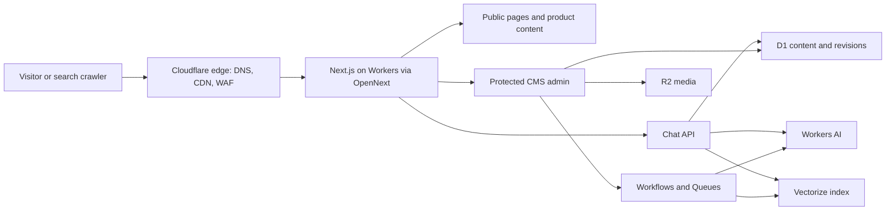
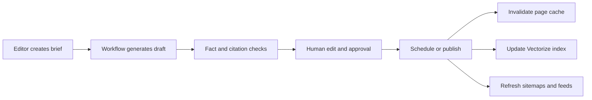

# NAVA — Website Building Plan

Version 1.0 · July 2026

## 1. Executive direction

Build NAVA as a fast, content-led Next.js website deployed to Cloudflare Workers. The website should present the company as a clear software partner with a focused hospitality specialty, not as a catalogue of unrelated technology.

The website has four business goals:

1. Generate qualified demo and project enquiries.
2. Explain the product portfolio without cognitive overload.
3. Build topical authority through an AI-assisted, human-approved publishing system.
4. Help visitors find answers through a grounded chatbot that can convert useful conversations into leads.

### Recommended positioning

**Category:** SaaS products and custom business software

**Primary audience:** Hotels and hospitality operators

**Secondary audience:** Growing service businesses that need better customer and operational systems

**Core promise:**

> Clear software for smoother operations and better customer experiences.

**Homepage headline direction:**

> Run your business with less manual work.

**Supporting copy:**

> NAVA builds hotel self-check-in, reputation, CRM, ERP, and AI-powered web systems that connect your customer experience with your daily operations.

**Primary CTA:** `Book a demo`

**Secondary CTA:** `Explore our solutions`

These are working messages. Validate them with five customers or prospects before final production copy.

## 2. Reduce the product portfolio into three buyer paths

Do not place five equal product cards directly under the hero. Visitors should first recognize their problem, then choose a path.

### Path 1 — Guest experience

- Hotel self-check-in
- Reputation management
- Promise: **Give every guest a faster arrival and a better reason to return.**

### Path 2 — Digital growth

- AI-powered website
- Reputation management
- CRM capabilities
- Promise: **Turn more searches, reviews, and enquiries into direct customer relationships.**

### Path 3 — Connected operations

- CRM
- ERP
- Integrations and automation
- Promise: **Replace scattered tools and manual updates with one clear operating system.**

Each product still receives its own indexable detail page. The paths are an information architecture device, not a change to the actual products.

## 3. Key idea messaging system

Use a small set of repeated, memorable messages throughout the website, sales decks, demos, and chatbot. Repetition reduces the mental work required to understand an offer.

### Five provisional NAVA core messages

1. **Problem:** `Disconnected tools create slow work and inconsistent customer experiences.`
2. **Empathy:** `Your team should spend time serving customers—not copying data between systems.`
3. **Answer:** `NAVA connects guest journeys, customer relationships, and operations in clear digital systems.`
4. **Change:** `Move from manual follow-up and scattered tools to workflows your team can trust.`
5. **Result:** `Work faster, serve customers better, and see what is happening across your business.`

### Messaging rules

- The customer is the main character; NAVA is the guide.
- Lead with a recognizable business problem, not a framework or technology.
- Use one promise in the hero. Do not name all features above the fold.
- Follow each claim with proof: a number, product screen, customer result, workflow, or demonstration.
- Reuse the same language. Familiarity reduces cognitive load.
- Keep headings under 12 words and paragraphs to two or three sentences.
- Replace adjectives with specifics: delivery time, automation step, supported integration, response time, or business result.

### Product-page core-message formula

`[Product] helps [specific customer] achieve [valuable result] without [painful old way].`

Examples:

- `Hotel self-check-in gives guests a faster arrival without adding pressure at reception.`
- `Reputation management helps hotel teams respond faster and turn guest feedback into action.`
- `An AI-powered website answers questions and captures enquiries—even when your team is offline.`
- `CRM keeps every customer conversation and next step in one clear place.`
- `ERP connects finance, inventory, people, and operations without duplicate data entry.`

## 4. Website structure

### Primary navigation

- Solutions
  - Guest experience
  - Digital growth
  - Connected operations
- Products
  - Hotel self-check-in
  - AI-powered website
  - Reputation management
  - CRM
  - ERP
- Work
- How we work
- Insights
- About
- `Book a demo` button

On mobile, show Solutions, Products, Work, Insights, About, and the CTA. Put secondary pages in the footer.

### Route map

```text
/
├── /solutions
│   ├── /guest-experience
│   ├── /digital-growth
│   └── /connected-operations
├── /products
│   ├── /hotel-self-check-in
│   ├── /ai-powered-website
│   ├── /reputation-management
│   ├── /crm
│   └── /erp
├── /work
│   └── /[case-study-slug]
├── /how-we-work
├── /insights
│   ├── /[slug]
│   ├── /topic/[topic]
│   └── /author/[author]
├── /about
├── /contact
├── /privacy
├── /terms
├── /accessibility
├── /llms.txt
├── /sitemap.xml
└── /robots.txt
```

If Thai content is part of launch, use explicit locale paths from day one:

```text
/en/...
/th/...
```

Do not automatically redirect search crawlers or people based only on IP. Suggest a language and remember the user's choice. Add `hreflang`, localized canonical URLs, and one sitemap per locale.

## 5. Homepage plan

### 1. Header

Short navigation, product mega menu, and one persistent `Book a demo` action.

### 2. Hero

- One outcome-led headline.
- One short explanation.
- Primary and secondary CTA.
- Real product montage or a simple connected-workflow animation.
- Three proof points only.

Suggested proof strip:

- Built around real hotel operations
- One team from strategy to support
- Secure, cloud-based systems

Replace these with measurable proof as soon as customer evidence is available.

### 3. Trust

Use real client logos, integration partners, security practices, or delivery metrics. Do not show invented counters.

### 4. “Where is work slowing you down?”

Three problem-led cards corresponding to Guest experience, Digital growth, and Connected operations.

### 5. Flagship product story

Feature hotel self-check-in first because it gives the company a credible market specialty. Use a guest journey:

`Booking → identity/details → payment/deposit → room access → review request`

Show where hotel staff save time and where the guest experience improves.

### 6. Product system

Show how the five products can work together. This is more persuasive than five isolated descriptions.

### 7. Featured case study

Use this structure:

- Client situation
- What was getting in the way
- What NAVA changed
- Two measured results
- Delivery timeline

### 8. How we work

Four steps: `Understand → Design → Build → Improve`.

### 9. Technical confidence

Explain ownership, integrations, security, backups, monitoring, and support in plain language. Link to a detailed security page later.

### 10. Insights

Show three articles from distinct topic clusters, not simply the latest posts.

### 11. Final CTA

Headline: `What would you like to make simpler?`

CTA: `Book a 30-minute discovery call`

Explain what happens after the click.

## 6. Product-page template

Every product page should answer these questions in order:

1. Is this for a business like mine?
2. What problem does it remove?
3. What changes for my customer and team?
4. How does it work?
5. Does it connect with my current systems?
6. Is it secure and reliable?
7. What does implementation involve?
8. What proof do you have?
9. What should I do next?

### Standard sections

- Audience eyebrow
- Product promise and primary CTA
- Product screen or process demonstration
- Pain-to-outcome comparison
- Three core workflows
- Integrations
- Results/case study
- Implementation timeline
- Security and support
- FAQ
- Demo CTA

### Required conversion offers

| Product | Primary action | Lower-friction action |
|---|---|---|
| Hotel self-check-in | Book a demo | See the guest journey |
| AI-powered website | Request a website review | View an example |
| Reputation management | Book a demo | Get a review-response checklist |
| CRM | Discuss your workflow | See CRM use cases |
| ERP | Request a discovery workshop | Download the readiness checklist |

## 7. Visual direction

### Light blue as the recognizable brand signal

Light blue should create recognition and spaciousness, but it cannot safely carry small white text in most cases. Use a darker blue for accessible actions and light blue for backgrounds, illustration fields, highlights, and data visualization.

| Role | Color | Use |
|---|---:|---|
| Brand light blue | `#67D4FF` | Hero atmosphere, diagrams, large graphic fields |
| Soft sky | `#EAF8FF` | Alternate backgrounds, cards, badges |
| Action blue | `#075F8F` | Primary buttons and links |
| Action hover | `#064B70` | Hover/pressed state |
| Deep ink | `#071722` | Headings and dark sections |
| Body | `#405566` | Paragraphs |
| Border | `#D9E8F0` | Dividers and controls |
| White | `#FFFFFF` | Main surface |
| Success teal | `#087A68` | Status and success |

Use light blue across roughly 10–15% of a page, not as a full-page wash. Most of the site should remain white and deep ink so content is calm and readable.

### Homepage visual language

- White space and strong typographic hierarchy.
- Real UI screens, no generic 3D technology illustrations.
- Thin light-blue lines showing connected workflows.
- One focal visual per section.
- Dark technical panels only where code, integrations, or operational data are being explained.
- Animation is subtle: 8–16px reveal distance, no continuous decorative pulsing.

Before implementation, reconcile these colors with `design-tokens.css` and treat this plan as the newer direction.

## 8. Technical architecture

### Recommended stack

| Layer | Choice | Purpose |
|---|---|---|
| Application | Next.js App Router + TypeScript | Marketing site, CMS admin, API routes |
| Hosting | Cloudflare Workers via OpenNext | SSR, SSG, ISR, streaming, global delivery |
| Styling | Tailwind CSS + accessible primitives | Token-based responsive UI |
| Content database | Cloudflare D1 | Posts, pages, revisions, authors, leads, chat records |
| Media | Cloudflare R2, optionally Cloudflare Images | Original assets and optimized delivery |
| AI inference | Workers AI | Drafting, summaries, chatbot responses, embeddings |
| Retrieval | Vectorize | Ground chatbot and editorial tools in approved content |
| Background work | Cloudflare Workflows + Queues | AI jobs, indexing, scheduled publishing, retries |
| Bot protection | Turnstile + WAF/rate limits | Forms, CMS login boundary, chatbot abuse prevention |
| Admin access | Cloudflare Access | Protect `/admin` before it reaches the application |
| Analytics | Cloudflare Web Analytics + first-party events | Traffic, Core Web Vitals, conversion measurement |
| Deployment | GitHub + Workers Builds | Preview, production, controlled releases |

### System diagram



### Next.js implementation rules

- Use the App Router and Server Components by default.
- Keep client components limited to navigation, filters, forms, editor controls, and chatbot UI.
- Use SSG/ISR for marketing, product, case-study, and blog pages.
- Use SSR only for preview, protected admin, and user-specific experiences.
- Use Route Handlers for chat streaming, webhooks, media signing, and public APIs.
- Initialize D1 wrappers, AI clients, and external service clients lazily—never at module import time.
- Pin stable, patched Next.js and React versions; do not launch on canary releases.
- Test with the Cloudflare preview runtime, not only the Next.js development server.
- Avoid depending on experimental caching or Partial Prerendering for the initial release.
- OpenNext currently requires the compatible middleware approach. Do not make authentication depend on Next.js middleware/proxy; enforce it at Cloudflare Access and again in protected server code.

### Suggested source structure

```text
src/
├── app/
│   ├── (marketing)/
│   │   ├── page.tsx
│   │   ├── solutions/
│   │   ├── products/
│   │   ├── work/
│   │   ├── insights/
│   │   └── contact/
│   ├── admin/
│   │   ├── layout.tsx
│   │   ├── posts/
│   │   ├── media/
│   │   ├── redirects/
│   │   └── settings/
│   ├── api/
│   │   ├── chat/route.ts
│   │   ├── contact/route.ts
│   │   ├── preview/route.ts
│   │   └── webhooks/route.ts
│   ├── layout.tsx
│   ├── sitemap.ts
│   ├── robots.ts
│   └── manifest.ts
├── components/
│   ├── ui/
│   ├── marketing/
│   ├── cms/
│   └── chat/
├── content/
│   ├── schemas/
│   └── prompts/
├── lib/
│   ├── db/
│   ├── ai/
│   ├── seo/
│   ├── analytics/
│   └── security/
└── styles/
```

## 9. Blog CMS plan

Build the CMS as a protected part of the same Next.js application. Keep the public renderer separate from the editing interface so public pages remain fast and stable.

### Content types

- Blog post
- Case study
- Product page
- Solution page
- Landing page
- Author
- Topic
- Reusable FAQ
- Reusable CTA
- Redirect

### Post fields

- Internal title
- URL slug
- Public headline
- Short description
- Search title and meta description
- Primary topic and secondary topics
- Search intent
- Target audience
- Locale
- Canonical URL
- Hero image and alt text
- Modular content blocks
- FAQ items
- Related products
- Related posts
- Author and reviewer
- Sources/citations
- AI summary
- Publication status
- Publish/unpublish timestamps
- Revision history
- `noindex` control
- Structured-data type
- Social title, description, and image

### Editorial states

`Idea → Brief → AI draft → Human edit → Technical review → SEO/GEO review → Scheduled → Published → Refresh due → Archived`

### AI-assisted workflow

AI may:

- Cluster approved keywords and customer questions.
- Generate a content brief from a selected topic and intent.
- Suggest headlines and introductions aligned with the article's main takeaway.
- Produce a first draft using approved product knowledge.
- Suggest internal links, FAQs, metadata, and structured data.
- Flag unsupported claims or missing citations.
- Produce social excerpts and email summaries.
- Identify articles that need refreshing.

AI must not:

- Publish without human approval.
- Invent customer results, integrations, features, or testimonials.
- Rewrite cited facts without preserving the source.
- generate dozens of near-duplicate location or keyword pages.
- add a claim to the chatbot knowledge base before content approval.

### Publishing workflow



Use Cloudflare Workflows for multi-step AI generation and scheduled publishing because individual steps can retry safely. Use a Queue for indexing and notification work that should not slow the editor's request.

### Minimal D1 entities

```text
users
posts
post_localizations
post_revisions
content_blocks
authors
topics
post_topics
media
sources
redirects
ai_jobs
approvals
leads
chat_sessions
chat_messages
events
```

Store structured blocks as validated JSON where flexibility is important, but keep slugs, statuses, dates, authors, topics, and SEO fields as queryable columns.

## 10. SEO plan

### Technical SEO

- Server-render all indexable content.
- Create unique metadata with Next.js `metadata` and `generateMetadata`.
- Generate canonical URLs from one site-url configuration.
- Generate `robots.txt`, `sitemap.xml`, and segmented sitemaps when volume grows.
- Add XML sitemap entries only for canonical, indexable, published pages.
- Create dynamic Open Graph images for products, posts, and case studies.
- Use permanent redirects for changed slugs and prevent redirect chains.
- Return correct 404/410 responses; do not soft-404 missing content.
- Add breadcrumbs and visible internal links.
- Maintain one H1 and logical heading order.
- Keep important copy in HTML, not hidden inside images or chatbot responses.
- Set image dimensions and optimize media to protect Core Web Vitals.
- Add RSS/Atom and optional JSON Feed for insights.

### Structured data

Use only schema supported by visible page content:

- `Organization` on the site/about layer
- `WebSite` and `WebPage`
- `SoftwareApplication` or `Product` on suitable product pages
- `Service` for custom software offerings
- `Article`/`BlogPosting` on insights
- `BreadcrumbList`
- `FAQPage` only where the FAQ is visible and current policies allow it
- `LocalBusiness`/`ProfessionalService` only if a genuine public business location is presented

Sanitize JSON-LD before rendering. Validate with Google's Rich Results Test and Schema.org's validator.

### Topic clusters

Build authority around problems connected to products rather than publishing general AI news.

1. **Hotel arrival and guest operations**
   - self-check-in workflow
   - digital registration
   - guest identity and payments
   - front-desk efficiency
   - hotel technology integrations
2. **Hotel reputation and guest feedback**
   - review response
   - feedback analysis
   - service recovery
   - review request timing
3. **AI websites and direct conversion**
   - website chatbot
   - direct enquiry conversion
   - hospitality website UX
   - AI search readiness
4. **CRM and customer operations**
   - lead handoff
   - customer lifecycle
   - sales automation
   - single customer view
5. **ERP and connected business systems**
   - integration planning
   - data migration
   - operational reporting
   - build-versus-buy decisions

Start with one pillar page and three supporting articles per cluster. Publish fewer, stronger pages with first-hand examples.

## 11. GEO and AI-search readiness

This plan interprets GEO primarily as **Generative Engine Optimization**, while also covering geographic/local discovery.

### Generative Engine Optimization

- Give every page a direct 40–60 word answer near the beginning.
- Use descriptive headings framed around actual buyer questions.
- Publish named authors, reviewer credentials, update dates, and editorial policy.
- Cite primary sources and clearly distinguish facts, experience, and opinion.
- Use comparison tables, definitions, steps, limitations, and FAQs where helpful.
- Create stable entity pages for NAVA, each product, and each author.
- Keep product names, descriptions, company facts, and contact information consistent.
- Add JSON-LD that matches visible content.
- Publish `/llms.txt` as an additional discovery aid, not a replacement for crawlable HTML.
- Offer clean Markdown representations of long-form articles if maintainable.
- State which AI crawlers are allowed in `robots.txt` based on a deliberate licensing policy.
- Monitor brand citations and referral traffic from AI assistants, recognizing that measurement will be incomplete.

### Geographic SEO

- Create a strong Google Business Profile if customers can legitimately visit or contact the business locally.
- Keep name, address, phone, hours, and service area consistent.
- Create Thai and English pages only when each version is genuinely useful and human reviewed.
- Do not generate thin city pages.
- Use location case studies when there is real work and local context.
- If geographic personalization is used, do not change the canonical content invisibly based on IP.

## 12. Chatbot plan

The chatbot's first version should be a product and sales assistant, not a general-purpose AI.

### Jobs to be done

- Explain products in plain language.
- Recommend the right product or solution path.
- Answer implementation, integration, support, and security questions.
- Link to relevant product pages, articles, and case studies.
- Collect a qualified enquiry with consent.
- Hand off to a human when confidence is low or the visitor requests it.

### Grounded response architecture

1. Visitor asks a question.
2. Route Handler validates input, session, rate limit, and Turnstile risk signal.
3. Vectorize retrieves approved content chunks.
4. Workers AI generates an answer using only retrieved context and system rules.
5. The answer streams to the UI with source links.
6. D1 stores minimal session data, feedback, and conversion events according to the retention policy.

### Knowledge sources

- Published product and solution pages
- Approved help documentation
- Approved blog posts and case studies
- Pricing and implementation rules
- Security/support policies
- Curated FAQ records

Drafts, private notes, past chat answers, and unapproved AI output must not automatically become knowledge sources.

### Safety and trust requirements

- Display that the visitor is speaking with AI.
- Cite the pages used for material claims.
- Say when information is unavailable; never fabricate pricing, integrations, or guarantees.
- Treat retrieved text as untrusted data and defend against prompt injection.
- Keep system prompts and secrets server-side.
- Redact or refuse payment-card, password, government-ID, and health data.
- Ask consent before converting chat details into a sales lead.
- Set a defined retention period and provide a privacy notice.
- Rate-limit by session and network signals.
- Add thumbs up/down and “Talk to a person”.
- Log retrieval and model metadata for debugging without storing unnecessary personal data.

### Chatbot conversion flow

`Question → useful answer → one relevant follow-up → recommended page/demo → contact details with consent → human notification`

Do not interrupt the first page view with an open chat window. Use a quiet launcher and optionally invite interaction after meaningful engagement.

## 13. Forms, CRM, and analytics

### Forms

Use separate, short forms for:

- Product demo
- Software project enquiry
- Website review request
- Newsletter/content download

Protect submission endpoints with Turnstile, server validation, honeypot/time checks, rate limiting, and idempotency keys. Store the canonical lead in D1, then send notifications asynchronously.

### First-party event model

Track:

- `cta_clicked`
- `product_viewed`
- `case_study_viewed`
- `article_engaged`
- `chat_started`
- `chat_helpful`
- `chat_handoff_requested`
- `form_started`
- `form_submitted`
- `demo_booked`

Each event should include page, product/solution, locale, campaign parameters, and consent state. Do not collect sensitive chat text in general analytics.

### Primary business metrics

- Qualified leads by product
- Demo bookings by entry page
- Visitor-to-lead conversion
- Product-page-to-demo conversion
- Organic non-brand clicks by topic cluster
- AI-assistant referrals and assisted conversions
- Chat answer helpfulness and handoff rate
- Published-article refresh rate

## 14. Security, privacy, and reliability

- Gate `/admin` with Cloudflare Access and verify authorized identity in server code.
- Use least-privilege bindings and separate preview/production resources.
- Store secrets with Cloudflare secret management, never in source or client bundles.
- Patch Next.js and React promptly and use automated dependency updates.
- Apply CSP, HSTS, Referrer-Policy, Permissions-Policy, and secure cookie settings.
- Validate every API request with a shared schema library.
- Parameterize D1 queries and audit admin mutations.
- Scan uploaded files; restrict MIME type, dimensions, and size.
- Back up/export D1 content and R2 assets on a tested schedule.
- Add WAF and endpoint-specific rate limits for chat, preview, login, and forms.
- Define data retention for leads, analytics, chat, and editorial audit logs.
- Provide privacy, cookie, AI-chat, and data-request disclosures before launch.
- Create monitoring for availability, Worker errors, queue failures, AI failures, and broken links.

## 15. Performance budgets

At the 75th percentile on mobile:

- LCP ≤ 2.5 seconds
- INP ≤ 200 milliseconds
- CLS ≤ 0.1
- Initial JavaScript ≤ 160KB compressed for marketing routes
- Hero image ≤ 250KB where practical
- Total initial page weight ≤ 1.2MB

Additional rules:

- Render marketing pages primarily as Server Components.
- Load chatbot code after interaction or idle time.
- Self-host/subset fonts and use no more than two families.
- Lazy-load below-the-fold images and embeds.
- Reserve media dimensions.
- Cache public content and immutable assets at the edge.
- Do not load an editor, analytics dashboard, or AI SDK into public page bundles.

## 16. Delivery phases

### Phase 0 — Discovery and message validation (1–2 weeks)

- Interview 5–8 customers/prospects.
- Confirm primary audience and flagship product.
- Finalize five core messages.
- Inventory product features, integrations, proof, and screenshots.
- Define English/Thai launch scope.
- Confirm legal/privacy requirements and chatbot data policy.

**Exit:** approved message brief, product facts, audience priority, and content inventory.

### Phase 1 — Foundation (1 week)

- Scaffold Next.js through Cloudflare's current Next.js setup.
- Configure OpenNext, Workers preview, environments, D1, R2, and CI.
- Reconcile and implement design tokens.
- Add component primitives, testing, linting, formatting, and monitoring skeleton.

**Exit:** deployed preview with design-system page and production-like bindings.

### Phase 2 — Public MVP (3–4 weeks)

- Build header, footer, homepage, solution pages, five product pages, About, How we work, Contact, and legal pages.
- Implement forms, Turnstile, analytics, metadata, structured data, sitemap, robots, and OG images.
- Add first real case study and proof assets.
- Perform accessibility, responsive, SEO, and performance QA.

**Exit:** conversion-ready public website with no chatbot or AI publishing dependency.

### Phase 3 — CMS and content engine (2–3 weeks)

- Build protected admin, content models, media workflow, revisions, preview, redirects, and scheduled publishing.
- Add AI brief/draft/metadata assistance.
- Add human approval gates, citations, audit trail, and Vectorize indexing.
- Migrate launch content into the CMS.

**Exit:** editor can create, review, schedule, publish, update, and roll back content safely.

### Phase 4 — Grounded chatbot (2 weeks)

- Build chat UI and streaming endpoint.
- Create approved knowledge ingestion.
- Add retrieval, citations, safeguards, feedback, lead handoff, and analytics.
- Run evaluation set covering every product, limitations, unsafe input, and unknown questions.

**Exit:** chatbot meets answer-quality and safety thresholds and can hand off reliably.

### Phase 5 — Growth and localization (ongoing)

- Launch topic clusters and lead magnets.
- Add Thai localization if not in MVP.
- Add more case studies, comparison pages, and integration pages based on demand.
- Review search, GEO, chatbot, conversion, and performance data monthly.
- Run message and CTA tests one hypothesis at a time.

## 17. Launch acceptance criteria

### Messaging

- A new visitor can explain what NAVA does after five seconds.
- Hotel self-check-in is clearly presented as the flagship specialty.
- The three buyer paths are understood without opening a menu.
- Every important claim has evidence or is labeled as a capability rather than a result.

### Product and UX

- All routes work at 320–1440px and 200% zoom.
- Keyboard, screen reader, reduced motion, and form error flows pass QA.
- Chatbot never blocks navigation or core conversion.
- Every form has loading, success, duplicate, validation, spam, and failure states.

### SEO/GEO

- Canonicals, metadata, hreflang where applicable, robots, sitemaps, redirects, and structured data are validated.
- Every indexable page has unique intent and useful standalone content.
- Authors, dates, sources, and editorial policy are visible.
- AI-generated text has a recorded human approver.

### Engineering

- Cloudflare preview matches production runtime behavior.
- No secrets or privileged bindings reach the browser.
- Dependency and security checks pass.
- Backups and rollback are tested.
- Performance budgets and Core Web Vitals targets are met.
- Monitoring covers public pages, APIs, Workflows, Queues, and AI inference.

## 18. Decisions needed before implementation

These do not block the building plan, but they should be resolved in Phase 0:

1. Is hotel self-check-in definitely the flagship product?
2. Is launch English-only, Thai-only, or bilingual?
3. Are CRM and ERP packaged SaaS products, custom implementations, or both?
4. Which integrations are already production-ready?
5. What verified customer outcomes and testimonials may be published?
6. Will product pricing be public, starting-at, or demo-only?
7. Should the chatbot qualify leads only or also provide customer support?
8. Who can approve AI-generated content and technical claims?

## 19. Recommended first backlog

1. Approve audience priority and product grouping.
2. Interview customers and finalize the core messages.
3. Collect product screens, integrations, FAQs, and evidence.
4. Decide localization and URL strategy.
5. Scaffold the Cloudflare-ready Next.js application.
6. Implement tokens and a component showcase.
7. Build the homepage and hotel self-check-in page first.
8. Validate those two pages with prospects before scaling the template.
9. Build remaining public pages and conversion tracking.
10. Launch the public MVP before adding CMS automation and chatbot complexity.

## 20. Reference documentation

- [Cloudflare: Next.js on Workers](https://developers.cloudflare.com/workers/framework-guides/web-apps/nextjs/)
- [Cloudflare: RAG with Workers AI, D1, and Vectorize](https://developers.cloudflare.com/workers-ai/guides/tutorials/build-a-retrieval-augmented-generation-ai/)
- [Cloudflare: Workflows triggers and schedules](https://developers.cloudflare.com/workflows/build/trigger-workflows/)
- [Cloudflare: Turnstile](https://developers.cloudflare.com/turnstile/)
- [Next.js: Metadata and Open Graph images](https://nextjs.org/docs/app/getting-started/metadata-and-og-images)
- [Next.js: Sitemaps](https://nextjs.org/docs/app/api-reference/file-conventions/metadata/sitemap)
- [Next.js: Robots](https://nextjs.org/docs/app/api-reference/file-conventions/metadata/robots)
- [Next.js: JSON-LD](https://nextjs.org/docs/app/guides/json-ld)
